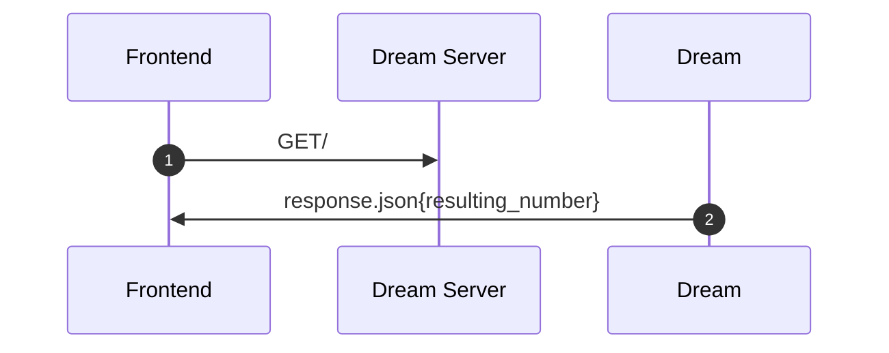
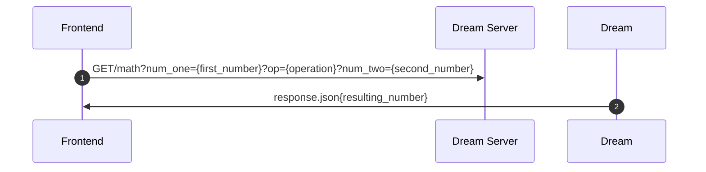

# Numerade


Numerafe a web app that uses machine learning to recognize written numbers to compute an operation, similar to a calculator. For instance, the user will use their mouse to draw the number “2”, then press a button for “+” and then draw the number “2”, press “=”, and our web app will display  “4.” We will preliminarily support the four operations of addition, subtraction, multiplication, and division. In addition, our machine learning model will be very well trained to read in any kind of variation of a numerical number, using the [mnist](https://github.com/datapythonista/mnist) dataset.

GitHub Repo URL: https://github.com/marcelo-morales/FPSE-FinalProject 


Implemantaion Plan can be found in the following Kanban board: https://github.com/users/marcelo-morales/projects/3 


## Installing / Getting started

To install all the dependencies, do:
```
opam install torch
opam install dream
opam install rescript
```

To run the MLtest, you have to be in the MLtest directory and do:

```
dune exec ./example.exe
```


To run the Dream Server as a localhost in your computer run:

```
dune build
dune exec ./server.exe
```

and then go to http://localhost:8080/ to visit the local changes made to the site.


## User Manual

Documentation for your users will navgiate the Numerade web app. 


## Design

Corresponding design and user interface wireframe sketching can be found in [this Notability page](https://notability.com/n/1Myv85vkl5ntlpK~nA1500).


## API Reference

This is the documentation of our API. It includes both public and Admin only endpoints. For endpoints tagged with Admin, You must provide a valid admin authorization token.


### Get Homepage of Numerade Website




### Get calculation




