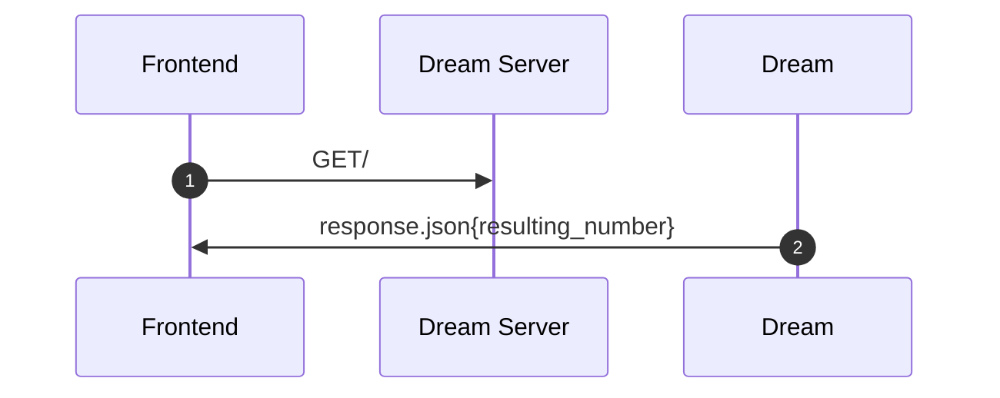
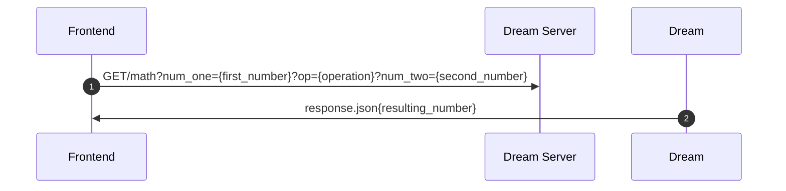

# Numerade


Numerade a web app that uses machine learning to recognize written numbers to compute an operation, similar to a calculator. For instance, the user will use their mouse to draw the number “2”, then press a button for “+” and then draw the number “2”, press “=”, and our web app will display  “4.” We will preliminarily support the four operations of addition, subtraction, multiplication, and division. In addition, our machine learning model will be very well trained to read in any kind of variation of a numerical number, using the [mnist](https://github.com/datapythonista/mnist) dataset.

GitHub Repo URL: https://github.com/marcelo-morales/FPSE-FinalProject 


Implemantaion Plan can be found in the following Kanban board: https://github.com/users/marcelo-morales/projects/3 


## Installing / Getting started

To install all the dependencies, do:
```
opam install torch
opam install dream
npm install rescript
```
. Ensure you have the package manager npm.
If you are on windows subsystem or linux and you are missing npm do:
```
sudo apt install npm
```
Make sure that you node version is atleast 16.x by doing:
```
node -v
```

## Machine Learning Part
To run the machine learning testsuite, you have to be in the most outer folder:

```
dune test
```
Look at the tests to see how the functions are run.

To train the neural network make sure that you are in backend/src:
```
cd backend/src
```

```
dune exec ./train_conv.exe
```
This should go close to 99% accuracy. To get better accuracy look at the executable file for tips

To test the neural network for a handwritten file be sure that you are in the most outer folder:
```
cd dune exec ./multiple_digits_tester.exe
```
Look at the comments of the multiple_digits_tester.ml to see which precollected handwritten digits you can test.
If you want to test you own handwritten numbers on the neural network, then put the image in the backend/tests/data - make sure that is the same format as the other data files


## Website Part

To run the Dream Server as a localhost in your computer run (ensure you are in the frontend directory).:

```
cd frontend/
npm install
npm start
# in another tab
cd frontend/
npm run server
```

and then go to http://localhost:8080/ to visit the local changes made to the site. There are additional instructions in [frontend](https://github.com/marcelo-morales/FPSE-FinalProject/tree/main/frontend) directory on how to run the web app. Ensure that you have a version of npm that is 8.1.2 or greater to be able to install all the dependencies for the web app.

```

```


## User Manual

Documentation for your users will navgiate the Numerade web app. 


## Design

Corresponding design and user interface wireframe sketching can be found in [this Notability page](https://notability.com/n/1Myv85vkl5ntlpK~nA1500).


## API Reference

This is the documentation of our API. It includes both public and Admin only endpoints. For endpoints tagged with Admin, You must provide a valid admin authorization token.


### Get Homepage of Numerade Website




### Get calculation




